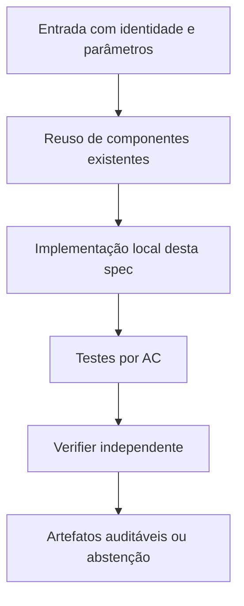

# CERT-01 — Piloto controlado dos oráculos de pricing — Design

**Spec:** `specs/cert-01-piloto-comparacao-pricing/spec.md`  
**Status:** RASCUNHO  
**Dependência:** Independente das FC-01–04; antes de CERT-02 e da campanha longa

## Architecture Overview

Criar runner diagnóstico fora de `run_n2_t5.py`, lendo/capturando snapshots racionais em uma execução NOVA. Para cada dual digest, fixar instância/K e avaliar cada oráculo sem modificar dual entre eles. Propor multiplicadores com scipy/Gurobi se disponível, depois usar matriz racional original `RationalLP` e `Fraction` para certificar. ENUM somente com `truncated=False` e prova de cobertura de conectados/terminais. Exportar uma linha por snapshot × oráculo com status, ell racional, LB Teorema L e Work/wall. Comparar a `c*` exata onde possível; computar diferença, não fingir força universal.

## Code Reuse Analysis

| Component / location | How to leverage |
|---|---|
| `n2_t3_cert_core.py` | `RationalDual`, N1 e Teorema L |
| `n2_t3_cert_box.py` | `propose_lp_multipliers`, `certify_box_bound` |
| `n2_t3_cert_enum.py` | ENUM e cobertura |
| `n2_t3_cert_integration.py` | snapshots do CG |
| `n2-t5-lb-versus-work.csv` | somente referência histórica, não contém todos os duais |

**Não duplicar** implementações matemáticas de `baseline`, `harness`, `fcc`, `fcc_k` e dos certificadores N2. Quando uma interface não fornecer o dado requerido, criar adaptação estreita e testada.

## Components and Interfaces

| Component | Purpose | Interface / responsibility |
|---|---|---|
| `diagnose_pricing_oracles.py` (novo) | Driver de snapshots e oráculos, orçamento controlado | `run_case(...)` |
| `n2_t3_cert_integration.py` | Hook opt-in de snapshot sem alterar modo legado | `record_dual_snapshot` opt-in |
| `test_diagnose_pricing_oracles.py` (novo) | Validação cruzada e cobertura | testes de min exato e cap |

## Data Models / Contracts

- `instance_sha256`: digest calculado sobre bytes reais da entrada.
- `k_sha256`: conjunto K canônico associado à instância, quando usado.
- `solver_numeric_*`: valor/status fornecidos pelo solver, sempre numericamente rotulados.
- `rational_verified_*`: valor exato `Fraction` e identificador de prova independente, ou ausente.
- `physical_ub_*`: incumbente com instalação e matching validados, ou ausente.
- `wall_total_s`: tempo monotônico de ponta a ponta por execução; `solver_runtime_s` é apenas sua subparte.
- `work_total`: soma de unidades Work do Gurobi, sem convertê-las em segundos.
- `stop_reason`: enum explícito; não traduzir cap/timeout/erro como zero ou sucesso.

Somente os campos relevantes devem ser adicionados aos módulos desta feature; não impor migração global antecipada.

## Error Handling Strategy

| Error | Handling | Published evidence |
|---|---|---|
| Falta de Gurobi ou licença | Falhar de forma explícita; não trocar solver | `SOLVER_UNAVAILABLE` com diagnóstico |
| Timeout/cap durante preparação | Abortar braço dentro do deadline global | Sem valor ótimal/global fabricado |
| Hash/K divergente | Bloquear combinação pareada | `INTEGRITY_ERROR` |
| Solução física inválida | Não publicar UB físico | `INVALID_PHYSICAL_WITNESS` |
| Prova racional ausente | Preservar apenas número do solver como diagnóstico | `NOT_CERTIFIED` |

## Risks & Concerns

| Concern (location) | Impact | Mitigation |
|---|---|---|
| `n2_t3_cert_integration.py`: N2-box zero | Oráculo N2 jamais melhora N1 por essa configuração | Ensaiar proposta não nula validada. |
| Runner N2-T5: ENUM não usado | Sem gold standard nos casos pequenos | Executar ENUM completo sob controle. |
| `n2_t3_cert_box.py`: relaxação de conectividade fraca | Limite ainda pode permanecer fraco | Registrar perda e somente depois propor subproblemas por raiz. |

## Tech Decisions

| Decision | Choice | Rationale |
|---|---|---|
| Compatibilidade | Preservar N1/N2 e caminhos existentes; novos módulos opt-in quando tocar legado | Não modificar evidência congelada. |
| Precisão | Racional para prova independente; float apenas para valores numéricos do solver e custo de execução | Evitar falsa certificação. |
| Experimentos | Novas pastas de saída, auditáveis por checksum | Reprodução e não sobreposição de evidências. |

## Alternatives considered

- **Reescrever tudo:** rejeitado por duplicar código matemático validado e aumentar risco de divergência.
- **Alterar in-place resultados históricos:** rejeitado por perder proveniência.
- **Adaptar o runner existente com interfaces estreitas:** **escolhido**, por reaproveitar validação e permitir regressão.

## Verification Strategy

Para cada requisito `ORCL-NN` em `spec.md`, escrever teste que checa resultado declarado, não apenas o fluxo interno da implementação. Asserções negativas são obrigatórias para timeout, cap e certificado inexistente quando pertinentes. O Verifier independente compara o estado final com `spec.md` e registra arquivo:linha, resultados executados e sensor de discriminação.
