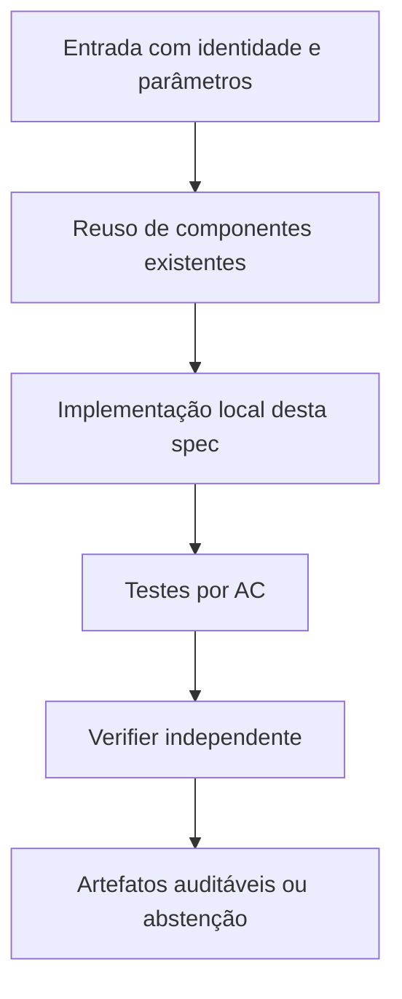

# CERT-02 — Testemunha primal racional e teste G2 — Design

**Spec:** `specs/cert-02-primal-racional-e-g2/spec.md`  
**Status:** RASCUNHO  
**Dependência:** CERT-01 (ao menos snapshots confiáveis)

## Architecture Overview

Novo módulo de testemunha primal racional com estruturas imutáveis que carregam identidade das colunas, mapeamento de S/T, y, λ e d. Capturar solução numérica e converter a candidatos racionais; opcional repair usando sistema linear exato para igualdades e checagem de todas desigualdades. Se falhar, abster-se, sem arredondar objetivo a favor. Calcular `gap=U_LP-LB_CG` em Fraction, conferir hashes K/instância/dual, e emitir `G2_CERTIFIED` apenas sob limite racional. `U_LP` é upper do LP, não automaticamente physical UB.

## Code Reuse Analysis

| Component / location | How to leverage |
|---|---|
| `n2_t3_cert_validation.py` | Verificador E5, K e G2 |
| `n2_t2b_master.py` | Dados primal e colunas |
| `n2_t3_cert_core.py` | Fraction e LB_CG |

**Não duplicar** implementações matemáticas de `baseline`, `harness`, `fcc`, `fcc_k` e dos certificadores N2. Quando uma interface não fornecer o dado requerido, criar adaptação estreita e testada.

## Components and Interfaces

| Component | Purpose | Interface / responsibility |
|---|---|---|
| `n2_t3_primal_witness.py` (novo) | Representação/reparação/verificação primal racional | `verify_primal(witness, model)` |
| `n2_t3_cert_validation.py` | Integração opt-in no gate G2 | `check_gap_g2` |
| `test_n2_t3_primal_witness.py` (novo) | Teste independente de R1–R4/K e gap | unittest com instâncias minúsculas |

## Data Models / Contracts

- `instance_sha256`: digest calculado sobre bytes reais da entrada.
- `k_sha256`: conjunto K canônico associado à instância, quando usado.
- `solver_numeric_*`: valor/status fornecidos pelo solver, sempre numericamente rotulados.
- `rational_verified_*`: valor exato `Fraction` e identificador de prova independente, ou ausente.
- `physical_ub_*`: incumbente com instalação e matching validados, ou ausente.
- `wall_total_s`: tempo monotônico de ponta a ponta por execução; `solver_runtime_s` é apenas sua subparte.
- `work_total`: soma de unidades Work do Gurobi, sem convertê-las em segundos.
- `stop_reason`: enum explícito; não traduzir cap/timeout/erro como zero ou sucesso.

Somente os campos relevantes devem ser adicionados aos módulos desta feature; não impor migração global antecipada.

## Error Handling Strategy

| Error | Handling | Published evidence |
|---|---|---|
| Falta de Gurobi ou licença | Falhar de forma explícita; não trocar solver | `SOLVER_UNAVAILABLE` com diagnóstico |
| Timeout/cap durante preparação | Abortar braço dentro do deadline global | Sem valor ótimal/global fabricado |
| Hash/K divergente | Bloquear combinação pareada | `INTEGRITY_ERROR` |
| Solução física inválida | Não publicar UB físico | `INVALID_PHYSICAL_WITNESS` |
| Prova racional ausente | Preservar apenas número do solver como diagnóstico | `NOT_CERTIFIED` |

## Risks & Concerns

| Concern (location) | Impact | Mitigation |
|---|---|---|
| Master atual: solução trivial U=|V| | G2 bloqueado independentemente do RMP | Reconstrução de primal próximo ao RMP. |
| Solver float para Fraction | Resíduos e violação de restrição por arredondamento | Repair exato ou abstenção. |

## Tech Decisions

| Decision | Choice | Rationale |
|---|---|---|
| Compatibilidade | Preservar N1/N2 e caminhos existentes; novos módulos opt-in quando tocar legado | Não modificar evidência congelada. |
| Precisão | Racional para prova independente; float apenas para valores numéricos do solver e custo de execução | Evitar falsa certificação. |
| Experimentos | Novas pastas de saída, auditáveis por checksum | Reprodução e não sobreposição de evidências. |

## Alternatives considered

- **Reescrever tudo:** rejeitado por duplicar código matemático validado e aumentar risco de divergência.
- **Alterar in-place resultados históricos:** rejeitado por perder proveniência.
- **Adaptar o runner existente com interfaces estreitas:** **escolhido**, por reaproveitar validação e permitir regressão.

## Verification Strategy

Para cada requisito `PRIM-NN` em `spec.md`, escrever teste que checa resultado declarado, não apenas o fluxo interno da implementação. Asserções negativas são obrigatórias para timeout, cap e certificado inexistente quando pertinentes. O Verifier independente compara o estado final com `spec.md` e registra arquivo:linha, resultados executados e sensor de discriminação.
