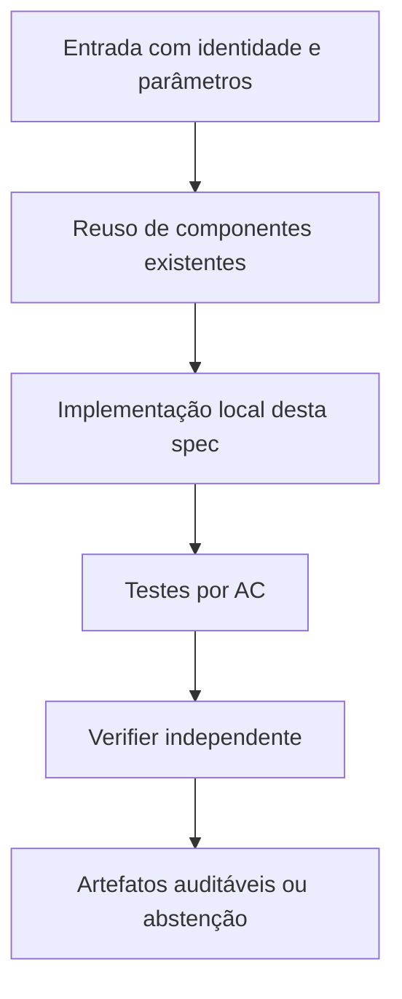

# FC-01 — Orçamento global e medição ponta a ponta — Design

**Spec:** `specs/fc-01-orcamento-global-e-tempos/spec.md`  
**Status:** RASCUNHO  
**Dependência:** Nenhuma; primeira correção do comparativo

## Architecture Overview

Introduzir um controlador de prazo por braço com `started_at_monotonic`, `deadline`, `remaining()` e métricas por fase. Para cumprir um teto de parede durante enumeração Python sem checkpoints cooperativos confiáveis, executar o braço em worker interrompível (subprocesso local supervisionado ou mecanismo equivalente documentado). Dentro do worker, passar o restante ao `Model.Params.TimeLimit`; ao expirar o deadline na preparação, reportar abstenção, nunca resultado parcial como completo. Não fazer o processo principal reiniciar o limite para cada etapa interna. `ru_maxrss` permanece pico cumulativo de processo enquanto não houver coleta isolada; rotular corretamente.

## Code Reuse Analysis

| Component / location | How to leverage |
|---|---|
| `fc_core.py` | `run_modality_a`, `run_modality_b_fcc_k`, `_solve_mip_with_evolution` |
| `fc_config.py` | `ExperimentConfig` e limites de LP/MIP |
| `fcc_k.py` | `lp_fcc_plus_k` e `build_fcc_plus_k` |
| `run_comparison.py` | CLI e tratamento de falhas |

**Não duplicar** implementações matemáticas de `baseline`, `harness`, `fcc`, `fcc_k` e dos certificadores N2. Quando uma interface não fornecer o dado requerido, criar adaptação estreita e testada.

## Components and Interfaces

| Component | Purpose | Interface / responsibility |
|---|---|---|
| `fc_budget.py` (novo) | Controle de deadline/worker e contrato de timeouts | `run_bounded(call, budget_s) -> Outcome` com relógio injetável |
| `fc_core.py` | Integração nas modalidades A e B | `run_modality_a`, `run_modality_b_fcc_k` |
| `fc_reporting.py` | Campos wall por fase e causa de timeout | `rows_for_instance` e CSV |

## Data Models / Contracts

- `instance_sha256`: digest calculado sobre bytes reais da entrada.
- `k_sha256`: conjunto K canônico associado à instância, quando usado.
- `solver_numeric_*`: valor/status fornecidos pelo solver, sempre numericamente rotulados.
- `rational_verified_*`: valor exato `Fraction` e identificador de prova independente, ou ausente.
- `physical_ub_*`: incumbente com instalação e matching validados, ou ausente.
- `wall_total_s`: tempo monotônico de ponta a ponta por execução; `solver_runtime_s` é apenas sua subparte.
- `work_total`: soma de unidades Work do Gurobi, sem convertê-las em segundos.
- `stop_reason`: enum explícito; não traduzir cap/timeout/erro como zero ou sucesso.

Somente os campos relevantes devem ser adicionados aos módulos desta feature; não impor migração global antecipada.

## Error Handling Strategy

| Error | Handling | Published evidence |
|---|---|---|
| Falta de Gurobi ou licença | Falhar de forma explícita; não trocar solver | `SOLVER_UNAVAILABLE` com diagnóstico |
| Timeout/cap durante preparação | Abortar braço dentro do deadline global | Sem valor ótimal/global fabricado |
| Hash/K divergente | Bloquear combinação pareada | `INTEGRITY_ERROR` |
| Solução física inválida | Não publicar UB físico | `INVALID_PHYSICAL_WITNESS` |
| Prova racional ausente | Preservar apenas número do solver como diagnóstico | `NOT_CERTIFIED` |

## Risks & Concerns

| Concern (location) | Impact | Mitigation |
|---|---|---|
| `fc_core.py`: TimeLimit do solver só após montagem | Excede teto e cria vantagem artificial | Worker controlado e testes de timeout na preparação. |
| `fc_core.py`: CAP_EXCEEDED retorna zero | Esconde custo de falha | Medir desde o primeiro passo. |

## Tech Decisions

| Decision | Choice | Rationale |
|---|---|---|
| Compatibilidade | Preservar N1/N2 e caminhos existentes; novos módulos opt-in quando tocar legado | Não modificar evidência congelada. |
| Precisão | Racional para prova independente; float apenas para valores numéricos do solver e custo de execução | Evitar falsa certificação. |
| Experimentos | Novas pastas de saída, auditáveis por checksum | Reprodução e não sobreposição de evidências. |

## Alternatives considered

- **Reescrever tudo:** rejeitado por duplicar código matemático validado e aumentar risco de divergência.
- **Alterar in-place resultados históricos:** rejeitado por perder proveniência.
- **Adaptar o runner existente com interfaces estreitas:** **escolhido**, por reaproveitar validação e permitir regressão.

## Verification Strategy

Para cada requisito `TIME-NN` em `spec.md`, escrever teste que checa resultado declarado, não apenas o fluxo interno da implementação. Asserções negativas são obrigatórias para timeout, cap e certificado inexistente quando pertinentes. O Verifier independente compara o estado final com `spec.md` e registra arquivo:linha, resultados executados e sensor de discriminação.
