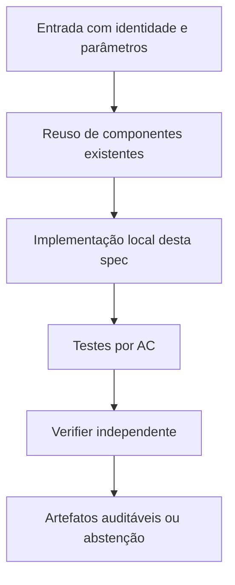

# FC-02 — Comparação inteira controlada COMP × F-CC+K — Design

**Spec:** `specs/fc-02-comparacao-comp-vs-fcc-k/spec.md`  
**Status:** RASCUNHO  
**Dependência:** FC-01 (medição confiável)

## Architecture Overview

Adicionar um braço `comp_mip` por reuso de `harness._make_mip`/`add_cuts_to_model` (verificar semântica exata da API real), com `y` binário e fluxo contínuo. `baseline` sem cortes continua opcional como ablação; não chamar `baseline` de COMP. Emparelhar por `instance_sha256`, `k_sha256`, tempo e seed, preservando orçamento separado por braço. Aplicar `independent_validator.viavel` ao conjunto de estações de cada incumbent. O relatório distingue comparativo primário (COMP MIP vs F-CC+K MIP) da ablação (base U sem K).

## Code Reuse Analysis

| Component / location | How to leverage |
|---|---|
| `experiments/cuts/harness.py` | `_make_mip` e `add_cuts_to_model` |
| `fc_core.py` | `run_modality_b_baseline` e `_validate` |
| `fcc_k.py` | `prepare_k` e modelo inteiro completo |

**Não duplicar** implementações matemáticas de `baseline`, `harness`, `fcc`, `fcc_k` e dos certificadores N2. Quando uma interface não fornecer o dado requerido, criar adaptação estreita e testada.

## Components and Interfaces

| Component | Purpose | Interface / responsibility |
|---|---|---|
| `fc_core.py` | Builder e executor do braço COMP MIP | `run_modality_b_comp` |
| `run_comparison.py` | Agendamento de três braços com principal separado de ablação | `run` / `--formulations` |
| `fc_reporting.py` | Campos `comparison_role`, `k_sha256`, `physical_ub_status` | `rows_for_instance` |

## Data Models / Contracts

- `instance_sha256`: digest calculado sobre bytes reais da entrada.
- `k_sha256`: conjunto K canônico associado à instância, quando usado.
- `solver_numeric_*`: valor/status fornecidos pelo solver, sempre numericamente rotulados.
- `rational_verified_*`: valor exato `Fraction` e identificador de prova independente, ou ausente.
- `physical_ub_*`: incumbente com instalação e matching validados, ou ausente.
- `wall_total_s`: tempo monotônico de ponta a ponta por execução; `solver_runtime_s` é apenas sua subparte.
- `work_total`: soma de unidades Work do Gurobi, sem convertê-las em segundos.
- `stop_reason`: enum explícito; não traduzir cap/timeout/erro como zero ou sucesso.

Somente os campos relevantes devem ser adicionados aos módulos desta feature; não impor migração global antecipada.

## Error Handling Strategy

| Error | Handling | Published evidence |
|---|---|---|
| Falta de Gurobi ou licença | Falhar de forma explícita; não trocar solver | `SOLVER_UNAVAILABLE` com diagnóstico |
| Timeout/cap durante preparação | Abortar braço dentro do deadline global | Sem valor ótimal/global fabricado |
| Hash/K divergente | Bloquear combinação pareada | `INTEGRITY_ERROR` |
| Solução física inválida | Não publicar UB físico | `INVALID_PHYSICAL_WITNESS` |
| Prova racional ausente | Preservar apenas número do solver como diagnóstico | `NOT_CERTIFIED` |

## Risks & Concerns

| Concern (location) | Impact | Mitigation |
|---|---|---|
| `fc_core.py`: baseline sem cortes como único controle inteiro | Confunde K e formulação | Adicionar COMP e reclassificar a comparação. |
| `harness.py`: parâmetros da fábrica MIP | Risco de impor f inteiro por engano | Teste estrutural de tipos das variáveis. |

## Tech Decisions

| Decision | Choice | Rationale |
|---|---|---|
| Compatibilidade | Preservar N1/N2 e caminhos existentes; novos módulos opt-in quando tocar legado | Não modificar evidência congelada. |
| Precisão | Racional para prova independente; float apenas para valores numéricos do solver e custo de execução | Evitar falsa certificação. |
| Experimentos | Novas pastas de saída, auditáveis por checksum | Reprodução e não sobreposição de evidências. |

## Alternatives considered

- **Reescrever tudo:** rejeitado por duplicar código matemático validado e aumentar risco de divergência.
- **Alterar in-place resultados históricos:** rejeitado por perder proveniência.
- **Adaptar o runner existente com interfaces estreitas:** **escolhido**, por reaproveitar validação e permitir regressão.

## Verification Strategy

Para cada requisito `PAIR-NN` em `spec.md`, escrever teste que checa resultado declarado, não apenas o fluxo interno da implementação. Asserções negativas são obrigatórias para timeout, cap e certificado inexistente quando pertinentes. O Verifier independente compara o estado final com `spec.md` e registra arquivo:linha, resultados executados e sensor de discriminação.
