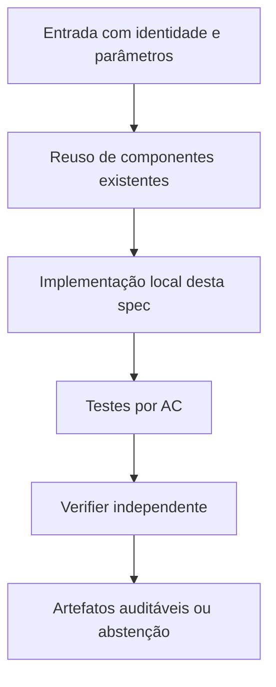

# FC-04 — Identidade de instâncias, integridade e relatórios — Design

**Spec:** `specs/fc-04-integridade-manifesto-e-relatorios/spec.md`  
**Status:** RASCUNHO  
**Dependência:** FC-01, FC-02 e FC-03 (schema final)

## Architecture Overview

Recalcular SHA-256 dos bytes lidos (sem transformação de newline), validar metadados do manifesto com parser `ms_utils`; erro de integridade falha antes da montagem. No final de cada nova execução, coletar lista explícita de arquivos de código relevante (scripts fc, baseline, harness, fcc, fcc_k), entradas e resultados, com hash e caminho relativo. Adicionar auditor independente `verify_comparison_artifacts.py` que recalcula digests; a referência do próprio manifesto é hash externo ou entregue à parte (não hash autorreferencial). Métricas de escalabilidade provêm de CSV e diferenciam sondados/cap/erro/sem medição.

## Code Reuse Analysis

| Component / location | How to leverage |
|---|---|
| `fc_instances.py` | `load_instance` com manifesto de instâncias |
| `fc_reporting.py` | `reproducibility_manifest` e hashes reutilizados |
| `results/formulation-comparison/` | Arquivos históricos apenas leitura |

**Não duplicar** implementações matemáticas de `baseline`, `harness`, `fcc`, `fcc_k` e dos certificadores N2. Quando uma interface não fornecer o dado requerido, criar adaptação estreita e testada.

## Components and Interfaces

| Component | Purpose | Interface / responsibility |
|---|---|---|
| `fc_instances.py` | Leitura SHA dos bytes e checks de metadados | `load_instance` |
| `fc_reporting.py` | Inventário de artefatos e relatório | `reproducibility_manifest` |
| `verify_comparison_artifacts.py` (novo) | Auditor de byte e invariantes tabulares | `verify(run_dir)` |

## Data Models / Contracts

- `instance_sha256`: digest calculado sobre bytes reais da entrada.
- `k_sha256`: conjunto K canônico associado à instância, quando usado.
- `solver_numeric_*`: valor/status fornecidos pelo solver, sempre numericamente rotulados.
- `rational_verified_*`: valor exato `Fraction` e identificador de prova independente, ou ausente.
- `physical_ub_*`: incumbente com instalação e matching validados, ou ausente.
- `wall_total_s`: tempo monotônico de ponta a ponta por execução; `solver_runtime_s` é apenas sua subparte.
- `work_total`: soma de unidades Work do Gurobi, sem convertê-las em segundos.
- `stop_reason`: enum explícito; não traduzir cap/timeout/erro como zero ou sucesso.

Somente os campos relevantes devem ser adicionados aos módulos desta feature; não impor migração global antecipada.

## Error Handling Strategy

| Error | Handling | Published evidence |
|---|---|---|
| Falta de Gurobi ou licença | Falhar de forma explícita; não trocar solver | `SOLVER_UNAVAILABLE` com diagnóstico |
| Timeout/cap durante preparação | Abortar braço dentro do deadline global | Sem valor ótimal/global fabricado |
| Hash/K divergente | Bloquear combinação pareada | `INTEGRITY_ERROR` |
| Solução física inválida | Não publicar UB físico | `INVALID_PHYSICAL_WITNESS` |
| Prova racional ausente | Preservar apenas número do solver como diagnóstico | `NOT_CERTIFIED` |

## Risks & Concerns

| Concern (location) | Impact | Mitigation |
|---|---|---|
| `fc_instances.py`: aceita SHA esperado sem comparar | Risco de comparar arquivos diferentes | Falha explícita por mismatch. |
| `fc_reporting.py`: hashes parciais | Experimento sem reprodução auditável | Incluir código novo e resultados. |
| `formulation-comparison-protocolo.md`: afirmações 8/10 e 75/75 | Conclusão extrapolada | Gerar contagens automáticas e revisar linguagem. |

## Tech Decisions

| Decision | Choice | Rationale |
|---|---|---|
| Compatibilidade | Preservar N1/N2 e caminhos existentes; novos módulos opt-in quando tocar legado | Não modificar evidência congelada. |
| Precisão | Racional para prova independente; float apenas para valores numéricos do solver e custo de execução | Evitar falsa certificação. |
| Experimentos | Novas pastas de saída, auditáveis por checksum | Reprodução e não sobreposição de evidências. |

## Alternatives considered

- **Reescrever tudo:** rejeitado por duplicar código matemático validado e aumentar risco de divergência.
- **Alterar in-place resultados históricos:** rejeitado por perder proveniência.
- **Adaptar o runner existente com interfaces estreitas:** **escolhido**, por reaproveitar validação e permitir regressão.

## Verification Strategy

Para cada requisito `AUDIT-NN` em `spec.md`, escrever teste que checa resultado declarado, não apenas o fluxo interno da implementação. Asserções negativas são obrigatórias para timeout, cap e certificado inexistente quando pertinentes. O Verifier independente compara o estado final com `spec.md` e registra arquivo:linha, resultados executados e sensor de discriminação.
