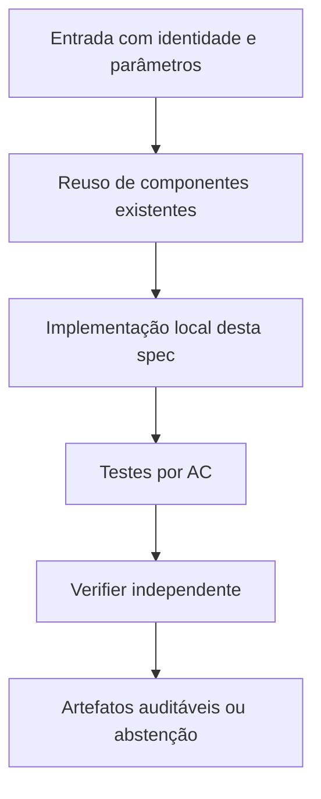

# FC-05 — Piloto corrigido e Gate de prontidão — Design

**Spec:** `specs/fc-05-piloto-corrigido-e-gate/spec.md`  
**Status:** RASCUNHO  
**Dependência:** FC-01, FC-02, FC-03 e FC-04 aprovadas; CERT-01 não é dependência para comparação LP completa

## Architecture Overview

Reexecução nova, controlada, por `run_comparison.py --tier pilot --lp-time-limit 60 --time-limit 120`; orçamento global implementado em FC-01. As linhas pareadas usam COMP MIP × F-CC+K MIP (baseline sem K como ablação); LP base/COMP/FCC para força. Auditor de SHA e testes verificam comparabilidade. Gate em JSON/MD somente read-only de resultados, contendo PASS/FAIL operacional por condição, e não PASS científico. Custo total contabiliza caps e falhas. Não chamar `run` principal quando Gate não estiver READY.

## Code Reuse Analysis

| Component / location | How to leverage |
|---|---|
| `run_comparison.py` | Tier pilot e CLI |
| `fc_reporting.py` | CSV/manifest |
| `verify_comparison_artifacts.py` | Reauditoria read-only de outputs |

**Não duplicar** implementações matemáticas de `baseline`, `harness`, `fcc`, `fcc_k` e dos certificadores N2. Quando uma interface não fornecer o dado requerido, criar adaptação estreita e testada.

## Components and Interfaces

| Component | Purpose | Interface / responsibility |
|---|---|---|
| `verify_comparison_pilot.py` (novo) | Avalia Gate de segurança por pares | `evaluate(run_dir)` |
| `run_comparison.py` | Parâmetros do tier pilot e status | `main` |
| `docs/technical/plans/execucao/formulation-comparison-piloto-corrigido.md` | Relato protocolado da nova rodada | dados gerados automaticamente |

## Data Models / Contracts

- `instance_sha256`: digest calculado sobre bytes reais da entrada.
- `k_sha256`: conjunto K canônico associado à instância, quando usado.
- `solver_numeric_*`: valor/status fornecidos pelo solver, sempre numericamente rotulados.
- `rational_verified_*`: valor exato `Fraction` e identificador de prova independente, ou ausente.
- `physical_ub_*`: incumbente com instalação e matching validados, ou ausente.
- `wall_total_s`: tempo monotônico de ponta a ponta por execução; `solver_runtime_s` é apenas sua subparte.
- `work_total`: soma de unidades Work do Gurobi, sem convertê-las em segundos.
- `stop_reason`: enum explícito; não traduzir cap/timeout/erro como zero ou sucesso.

Somente os campos relevantes devem ser adicionados aos módulos desta feature; não impor migração global antecipada.

## Error Handling Strategy

| Error | Handling | Published evidence |
|---|---|---|
| Falta de Gurobi ou licença | Falhar de forma explícita; não trocar solver | `SOLVER_UNAVAILABLE` com diagnóstico |
| Timeout/cap durante preparação | Abortar braço dentro do deadline global | Sem valor ótimal/global fabricado |
| Hash/K divergente | Bloquear combinação pareada | `INTEGRITY_ERROR` |
| Solução física inválida | Não publicar UB físico | `INVALID_PHYSICAL_WITNESS` |
| Prova racional ausente | Preservar apenas número do solver como diagnóstico | `NOT_CERTIFIED` |

## Risks & Concerns

| Concern (location) | Impact | Mitigation |
|---|---|---|
| Resultados anteriores não usam controle COMP inteiro | Comparação enviesada | Reexecutar novo tier antes de inferência. |
| Poucos casos pequenos | Conclusões restritas | Declarar amostra diagnóstica. |

## Tech Decisions

| Decision | Choice | Rationale |
|---|---|---|
| Compatibilidade | Preservar N1/N2 e caminhos existentes; novos módulos opt-in quando tocar legado | Não modificar evidência congelada. |
| Precisão | Racional para prova independente; float apenas para valores numéricos do solver e custo de execução | Evitar falsa certificação. |
| Experimentos | Novas pastas de saída, auditáveis por checksum | Reprodução e não sobreposição de evidências. |

## Alternatives considered

- **Reescrever tudo:** rejeitado por duplicar código matemático validado e aumentar risco de divergência.
- **Alterar in-place resultados históricos:** rejeitado por perder proveniência.
- **Adaptar o runner existente com interfaces estreitas:** **escolhido**, por reaproveitar validação e permitir regressão.

## Verification Strategy

Para cada requisito `PILOT-NN` em `spec.md`, escrever teste que checa resultado declarado, não apenas o fluxo interno da implementação. Asserções negativas são obrigatórias para timeout, cap e certificado inexistente quando pertinentes. O Verifier independente compara o estado final com `spec.md` e registra arquivo:linha, resultados executados e sensor de discriminação.
