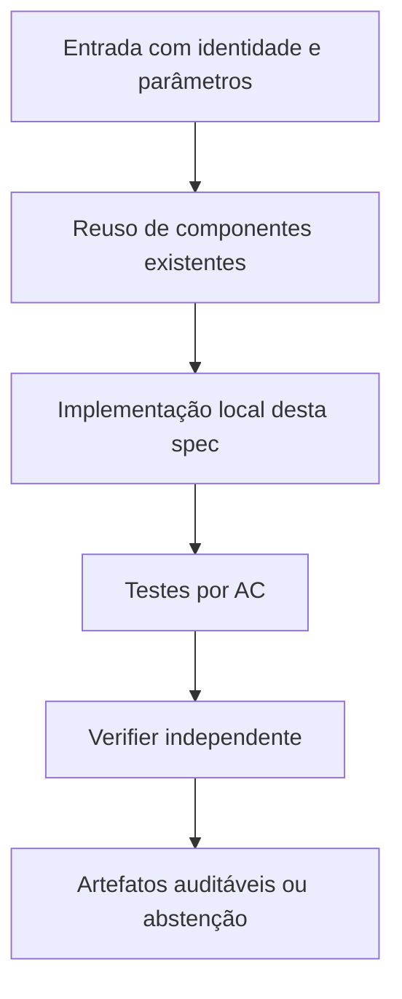

# FC-06 — Campanha pareada de até 3.600 segundos (condicional) — Design

**Spec:** `specs/fc-06-campanha-3600s-condicional/spec.md`  
**Status:** RASCUNHO  
**Dependência:** FC-05 `READY_FOR_EXTENDED` e seleção de instâncias documentada; CERT-01/CERT-02 são complementares, não substituem a comparação inteira

## Architecture Overview

Campanha nova, não automática. Runner confere Gate operacional e manifesto de seleção selado antes de qualquer solve longo. Programar pares COMP+K × F-CC+K completa, seeds 42/43/44, ordem alternada e gastos reais por braço; baseline sem K é ablação, LP força em modalidade separada. Critério de elegibilidade: mesmo problema e K, F-CC+K enumerável sob cap/guard e pelo menos um braço ainda não resolvido trivialmente no piloto, ou justificativa metodológica registrada. Instância sem solução por cap permanece na tabela como não comparável, não entra no ranking pareado como empate. Se não existir amostra informativa, STOP: documentar não executável e propor estudo de pricing distinto.

## Code Reuse Analysis

| Component / location | How to leverage |
|---|---|
| `fc_instances.py` | Pools e hashes |
| `run_comparison.py` | Executor confiável FC-01–05 |
| `fc_reporting.py` | Relatório pareado e métricas |
| `verify_comparison_pilot.py` | Gate de prontidão |

**Não duplicar** implementações matemáticas de `baseline`, `harness`, `fcc`, `fcc_k` e dos certificadores N2. Quando uma interface não fornecer o dado requerido, criar adaptação estreita e testada.

## Components and Interfaces

| Component | Purpose | Interface / responsibility |
|---|---|---|
| `run_extended_comparison.py` (novo) | Orquestra preflight/gates/seeds, sem sobrescrever outputs | `run_campaign(pre_registration)` |
| `fc_reporting.py` | Agregação pareada por origem e censura | `summarize_paired_results` |
| `docs/technical/plans/execucao/formulation-comparison-3600s.md` | Pré-registro e relatório da campanha | tabelas/limitações |

## Data Models / Contracts

- `instance_sha256`: digest calculado sobre bytes reais da entrada.
- `k_sha256`: conjunto K canônico associado à instância, quando usado.
- `solver_numeric_*`: valor/status fornecidos pelo solver, sempre numericamente rotulados.
- `rational_verified_*`: valor exato `Fraction` e identificador de prova independente, ou ausente.
- `physical_ub_*`: incumbente com instalação e matching validados, ou ausente.
- `wall_total_s`: tempo monotônico de ponta a ponta por execução; `solver_runtime_s` é apenas sua subparte.
- `work_total`: soma de unidades Work do Gurobi, sem convertê-las em segundos.
- `stop_reason`: enum explícito; não traduzir cap/timeout/erro como zero ou sucesso.

Somente os campos relevantes devem ser adicionados aos módulos desta feature; não impor migração global antecipada.

## Error Handling Strategy

| Error | Handling | Published evidence |
|---|---|---|
| Falta de Gurobi ou licença | Falhar de forma explícita; não trocar solver | `SOLVER_UNAVAILABLE` com diagnóstico |
| Timeout/cap durante preparação | Abortar braço dentro do deadline global | Sem valor ótimal/global fabricado |
| Hash/K divergente | Bloquear combinação pareada | `INTEGRITY_ERROR` |
| Solução física inválida | Não publicar UB físico | `INVALID_PHYSICAL_WITNESS` |
| Prova racional ausente | Preservar apenas número do solver como diagnóstico | `NOT_CERTIFIED` |

## Risks & Concerns

| Concern (location) | Impact | Mitigation |
|---|---|---|
| F-CC+K completa enumerável só em casos pequenos | Poucos casos realmente difíceis | Gate de elegibilidade e possibilidade de encerrar sem campanha. |
| Efeito de seleção e timeouts | Viés a favor de sucessos | Preservar censura e seeds pré-fixadas. |

## Tech Decisions

| Decision | Choice | Rationale |
|---|---|---|
| Compatibilidade | Preservar N1/N2 e caminhos existentes; novos módulos opt-in quando tocar legado | Não modificar evidência congelada. |
| Precisão | Racional para prova independente; float apenas para valores numéricos do solver e custo de execução | Evitar falsa certificação. |
| Experimentos | Novas pastas de saída, auditáveis por checksum | Reprodução e não sobreposição de evidências. |

## Alternatives considered

- **Reescrever tudo:** rejeitado por duplicar código matemático validado e aumentar risco de divergência.
- **Alterar in-place resultados históricos:** rejeitado por perder proveniência.
- **Adaptar o runner existente com interfaces estreitas:** **escolhido**, por reaproveitar validação e permitir regressão.

## Verification Strategy

Para cada requisito `HOUR-NN` em `spec.md`, escrever teste que checa resultado declarado, não apenas o fluxo interno da implementação. Asserções negativas são obrigatórias para timeout, cap e certificado inexistente quando pertinentes. O Verifier independente compara o estado final com `spec.md` e registra arquivo:linha, resultados executados e sensor de discriminação.
